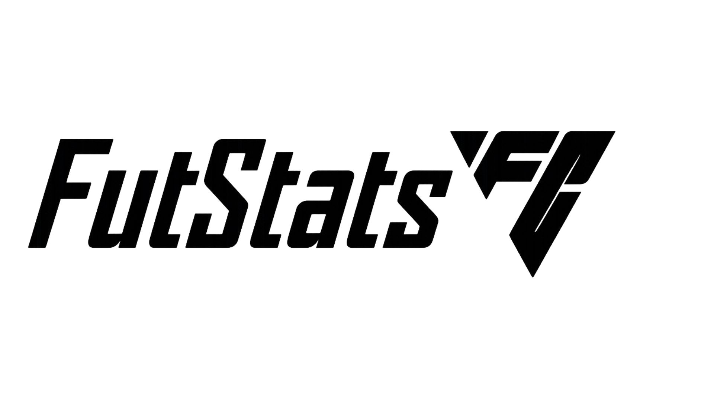

# **FutStatsFC**

O **FutStatsFC** é um website desenvolvido como projeto individual do 1º semestre do curso de Análise e Desenvolvimento de Sistemas da **SPTech School**. Inspirado no jogo **EA FC (antigo FIFA)**, o sistema permite registrar partidas e visualizar análises completas de desempenho através de gráficos, KPIs e estatísticas gerais.

---

**Sobre o Projeto**
O FutStatsFC nasceu da união entre minha paixão por futebol e meu interesse por tecnologia. O projeto aplica conhecimentos adquiridos ao longo do semestre, utilizando:

- **HTML, CSS e JavaScript** (Front-end) 
- **Node.js** (Back-end)
- **MySQL** (Banco de Dados)  
- **API** para envio e consulta de dados 
- **Dashboard** com gráficos e indicadores de desempenho

---

**Objetivo**
Criar uma plataforma onde o usuário possa:

- Cadastrar-se e fazer login 
- Registrar partidas do EA FC 
- Visualizar estatísticas, KPIs e gráficos de desempenho

---

**Escopo do Projeto**
O FutStatsFC inclui:

- Página inicial apresentando o tema e o propósito do projeto  
- Sistema de cadastro e login  
- Integração com MySQL através de API em Node.js  
- Dashboard com:  
  - Gráfico de pizza (vitórias, empates e derrotas)  
  - Gráfico de barras (gols feitos e sofridos nas últimas 10 partidas)  
  - KPIs (médias, precisão, saldo, aproveitamento)  
  - Estatísticas gerais  
- Front-end desenvolvido em **HTML, CSS e JS**  
- Versionamento no **GitHub**  
- Organização do desenvolvimento no **Trello**
