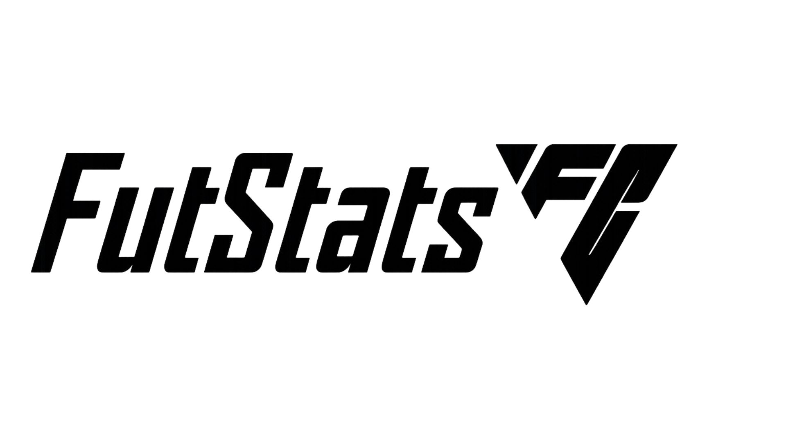

# FutStatsFC

O **FutStatsFC** é um website desenvolvido como projeto individual do primeiro semestre do Curso Superior de Tecnologia em Análise e Desenvolvimento de Sistemas. Inspirado no universo do jogo **EA FC**, o site tem como objetivo criar um espaço onde os fãs do futebol virtual possam se cadastrar e registrar seus resultados e estatísticas dentro do jogo.

---

## Sobre o Projeto

Desde criança, sempre fui apaixonado por futebol e pelo jogo **EA FC**, que se destaca pelo seu realismo, jogabilidade envolvente e variedade de modos de jogo. Essa paixão me inspirou a desenvolver o **FutStatsFC**, unindo o que gosto ao aprendizado em tecnologia adquirido na faculdade SPTech School.

O projeto busca aplicar na prática os conhecimentos adquiridos nas disciplinas do semestre, utilizando **HTML**, **CSS**, **JavaScript**, **Node.js** e **Banco de Dados** para construir um site funcional e interativo.

O **FutStatsFC** inclui:

- **Página inicial** apresentando o tema e o propósito do projeto;  
- **Formulário de cadastro**;  
- **Integração com Node.js** para envio e consulta dos dados;  
- **Banco de dados MySQL** para armazenar informações dos usuários;  
- **Área de login e consulta** de perfis;  
- **Dashboard** exibindo resultados e desempenho do jogador.